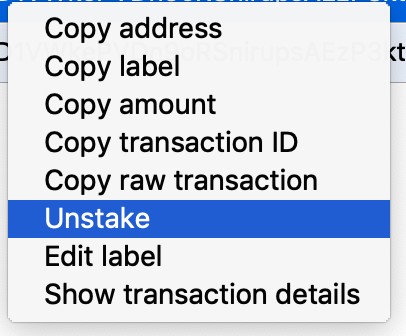

##如何抵押?
从块高度1801开始,矿工需要在钱包作出相应的操作来进行Stake.Stake的Diskcoin越多,则收益越多.Stake要在下一个爆块后生效,unstake要在900个块确认后生效.

###Linux 系统:
如何Stake:
```
./diskcoin-cli staketo the-wallet-address-you-stake-to the-stake-amount  
```
以上地址必须是爆块地址.

如何检查默认的钱包地址:
```
./diskcoin-cli getaccountaddress ""
```
Staking完成后会返回一个哈希值.

检查Staking数据的地址:
```
liststakein (minconf maxconf  ["address",...])
```
最小确认数: Minconf: minimum confirmation
最大确认数: Maxconf: maximum confirmation

解除抵押:
```
./diskcoin-cli unstake txid
```
用"listStakein"命令去获得已Stake的txid
通过"diskcoin-cli unstake txid"命令解除Stake

###Windows/MacOS 系统(以MacOS系统为例,Windows系统操作同理)
如何Stake:
启动钱包,单击上方导航栏中的"Send",在"Stake to"中填写要Stake的地址,然后在"Amount"中填写要Stake的金额. 确保左下方是Stake to,单击"Send".


如何查看Staked记录:
在上方导航栏"Transactions"的选项下找到Staked in的记录,如图所示:


如何取消Stake:
选中需要取消的Stake记录,点击右键,选择"Unstake"
