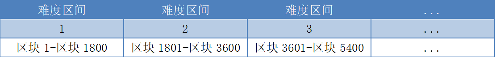
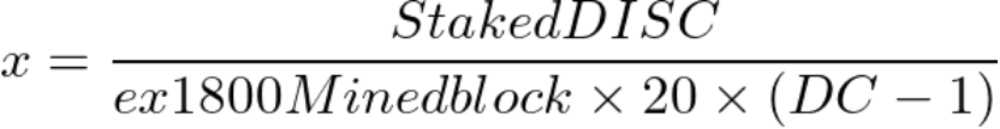

##抵押规则

要理解Staking规则,首先要明确一个概念-难度区间.我们将区块分成若干个难度区间,每1800个区块为一个难度区间.区块1至区块1800;为第一个难度区间,区块1801至区块3600;为第二个难度区间,以此类推.示意图如下:

官网的区块链浏览(https://explorer.diskcoin.org/) 可以查看当前爆块的难度区间.

Staking公式如下:

如果x为整数,则x=n；如果x不是整数,则向上取整,n=INT(x)取值范围:n-1<x<=n

收益率公式:
因为x是一个合作系数,以下是合作系数的公式:

####ex1800Minedblock: 前1800个块爆的块(当前高度不包括)
####难度区间(DC): 当前区块高度位于哪一难度区间

举个例子:
条件:当前挖到的块高度是1977,在块高度176-1976之间我爆块26个,stake了101个Diskcoin.
合作系数为:

因为x不是整数,所以n=INT(0.19423+1)=1.那么收益率如下:

所以收益率为45.82%
