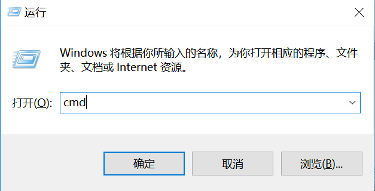
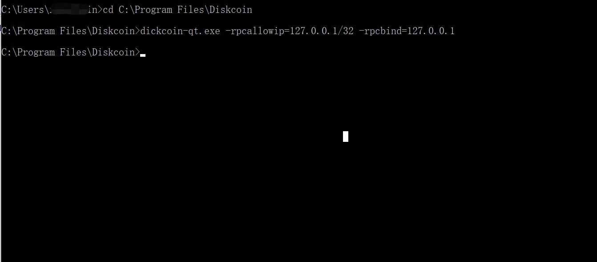

##Plotter ID

请通过以下链接: https://diskcoin.org/PidGenerator/index.html#btnGroup, 检查PID是否适用Diskcoin挖矿.如果适用,矿工无需重新P盘.如果不适合,则需要通过上述链接生成新的PID,重新P盘才能挖Diskcoin.由Diskcoin PID生成器生成的PID可以挖其它PoC币种.

###P盘软件

ENGRAVER

制造商:PoC-Consortium

下载链接: https://github.com/PoC-Consortium/engraver

适用系统: Linux, MacOS

安装指引: Compile from Source

TurboPlotter 9000

制造商: Blackpawn

下载链接: https://blackpawn.com/tp/

适用系统: Windows, Linux, MacOS

XPlotterGui

制造商: JohnnyFFM

下载链接: https://github.com/JohnnyFFM/XPlotterGui/releases/latest

适用系统: Windows

XPlotter modded

制造商: JohnnyFFM

下载链接: https://github.com/JohnnyFFM/XPlotter/releases/latest 

适用系统: Windows

##挖矿

###挖矿准备
挖矿设备: 一个组装好并且p好盘的硬盘挖矿设备(硬盘容量越大,收益越高).
钱包支持系统: Linux/Windows/MacOS
挖矿支持系统: Windows系统
挖矿软件: dcminer或ddProxy

###安装Diskcoin钱包

1. 钱包下载
打开钱包下载地址: https://github.com/diskcoin-apps-team/wiki/releases 根据个人电脑系统选择适配的钱包下载,如下图:


2. 钱包配置

Windows钱包配置
将钱包下载到Windows的电脑,并解压.如果之前安装过钱包,不能正常同步数据.请先删除之前的数据再安装.

调试文件
文件"diskcoin.conf"默认不需要修改,除非端口已经被占据.

运行钱包
Window系统连接到Solo挖矿需要配置钱包.

(1)首先进入到钱包的安装目录,安装目录下面有一个diskcoin-qt.exe文件,如下图所示:


(2)同时按下"Windows徽标键"和"R",在搜索框输入"cmd",如下图所示:


(3)点击"确定"后进入windows的控制台界面.将步骤1上面的diskcoin-qt.exe按住拖到控制台界面,如下图所示:


(4)然后在控制台界面输入以下命令后,按Enter键,如下图所示:
```
空格 -rpcallowip=127.0.0.1/32 -rpcbind=127.0.0.1
```


Windows完整的启动命令应该是:
```
你的钱包安装路径/diskcoin-qt.exe  -rpcallowip=127.0.0.1/32 -rpcbind=127.0.0.1
```

MacOS钱包配置
MacOS系统与Windows系统同理,但执行命令不同.

MacOS的执行命令:
```
Applications/Diskcoin-Qt.app/Contents/MacOS/Diskcoin-Qt -rpcallowip=127.0.0.1/32 -rpcbind=127.0.0.1
```


Linux系统钱包配置
请下载适合Linux系统版本的钱包,将其复制粘贴到Linux系统并解压.

调试文件
文件"diskcoin.conf"默认不需要修改,除非端口已经被占据.
cd diskcoin

运行diskcoind服务
```
./diskcoind -rpcbind=127.0.0.1 -rpcallowip="127.0.0.1/32"
``` 

等待钱包同步节点数据
```
./diskcoin-cli getinfo View current block height
./diskcoin-cli getblockcount View the latest height
```
如果两个值都相同,表示节点数据已经同步,可以开始挖矿了.

出现如下图所示,钱包正常启动,就可以配置miner文件开始挖矿了.


###开始挖矿
dcminer 要在Windows系统运行.修改挖矿的配置文件: miner.conf

``` 
"Server" :"127.0.0.1",
"Port": 63336,
"UpdaterAddr" : "127.0.0.1",
"UpdaterPort": 63336,
"InfoAddr" : "127.0.0.1",
"InfoPort": 63336,
MinerName = m1 #can be empty
``` 

其它值可以用文本内默认的值.
在启动dcminer时,请按以下顺序,建议先使用dcminerAVX512,如果不能启动,再用dcminerAVX2,然后是dcminerAVX,如果上述三个都无法运行,最后使用dcminer启动.


Download installation package: https://github.com/diskcoin-apps-team/wiki/releases/latest
