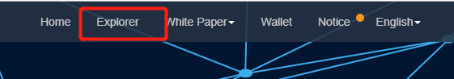
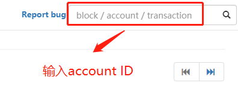
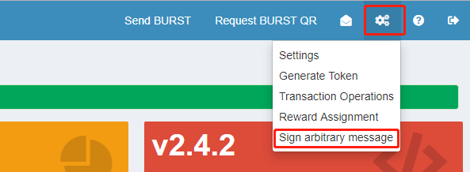

##Diskcoin基金会第一期空投福利来袭

自Diskcoin上线以来, 受到了各位矿工的关注与支持. 为了表示对大家的感谢, Diskcoin基金会决定开启第一期的空投福利.

空投数量: 5000枚DISC

分配规则: 矿工随机获得分配，最高可得10 DISC

空投对象: 在Burst,BHD或DISC获得过爆块奖励的矿工

(1个PID只能获取一份奖励)

参与空投要求: 下载并安装Diskcoin钱包

##空投教程
###如何查看PID (Account ID) 是否爆过块

1. BHD爆块确认
点击以下链接: <https://btchd.org/>

选择"Explorer", 如下图所示:

输入自己的PID, 点击"Search", 查看是否有过爆块, 如下图所示:

如果有过爆块记录, Active Bind下面会显示过去的爆块记录, 如果没有爆过块, Active Bind下面则显示为空, 如下图所示:

2. Burst爆块确认
点击以下链接: <https://explore.burst.cryptoguru.org/>

在如下图所示方框内处输入自己的Account ID, 点击搜索.

跳转到下一界面后, 会出现个人信息和爆块记录, 爆块记录显示在页面的左下角, 如下图所示: 

3. Diskcoin爆块确认
点击以下链接: <https://explorer.diskcoin.org/>
如下图所示, 在方框内输入自己的PID, 下方会出现"Total mined blocks", 如果显示数量大于等于1, 说明该PID爆过块.

###Diskcoin钱包安装
请点击以下链接访问钱包安装教程: <https://www.diskcoin.wiki/cn/Miningcn/#diskcoin>

###怎么获取Publickey和Signature？
点击以下链接: <https://wallet.burst-alliance.org:8125/index.html#>
选择"Returning User", 在下图所示的框内输入个人钱包的脑密码, 登入.

跳转到下图所示界面后, 点击红色方框标识出的符号,选择"Sign arbitrary message", 点击进入.

会出现一个弹窗, 如下左图所示, 将右图所示生成的Message签名信息复制到左图所示的方框内, 然后在下面指示框内输入脑密码, 点击"Sign Message".

如下图所示, 会出现一个蓝色方框, 里面生成的就是我们资料填写需要的Signature和Publickey, 复制下来.

请将复制的Signature和Publickey填入下图所示对应的方框内.

