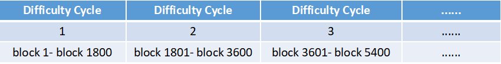
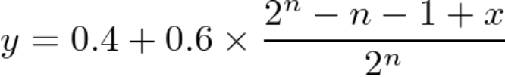

## The DES rules

To understand the Dynamic Equilibrium Staking rules, you need to know what the Difficulty Cycle (DC) is. We creatively define these blocks as continuous Difficulty Cycles, and each 1800 blocks is a Difficulty Cycle. The first Difficulty Cycle is from block 1 to 1800, and the second Difficulty Cycle is from block 1801 to 3600, and so on. There follows a diagram for your reference:

If you want to check the Difficulty Cycle of the rewarded block, you could view it in the [explorer](https://explorer.diskcoin.org/).

Here is the reward ratio formula: 

If x is an integer, then n=x; if x is not an integer, the n=INT(x+1).  (Range: n-1<x<=n)

Since x is a Cooperative Factor, there follows a calculation formula:

ex1800Minedblock: mined blocks during the last 1800 blocks (the current block not included) 

Difficulty Cycle (DC): the current block height lays in which difficulty cycle

For example: 
Condition: The rewarded block is 1977, and you mined 26 blocks during the last 1800 blocks, which is from block 176 to block 1976, and you staked 101 DISCs. Then the Cooperative Factor is as follows: 

Since x is not an integer, so n=INT(0.19423+1)=1
reward ratio in example:

So the the reward ratio is 45.82%.

