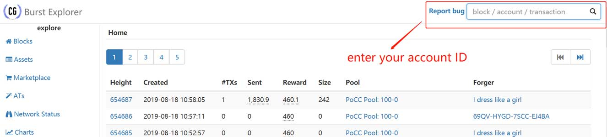
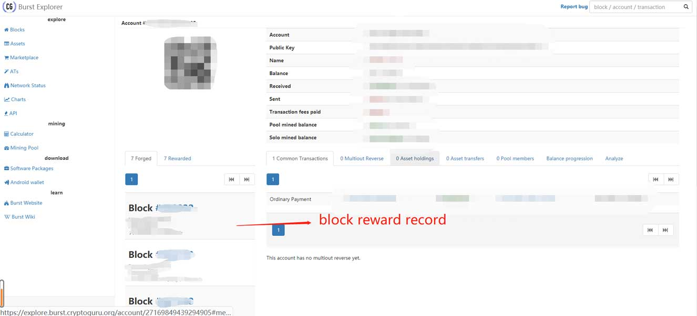
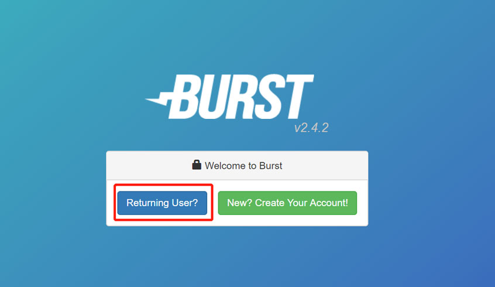
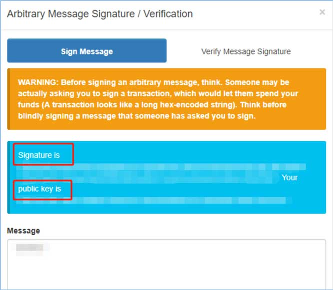

##Diskcoin Foundation launched Super Airdrop (the first phrase)

Since its launch, the Diskcoin project has been receiving much attention and support. In order to express our gratitude, Diskcoin Foundation launched Super Airdrop (the first phrase).

Airdrop amount: 5000 DISC
Airdrop rules: each miner randomly get airdrop bonus, up to 10 DISC
Airdrop targets: Miners whose PID got Burst, BHD or DISC reward (one PID can only get one bonus). 
Airdrop requirement: install Diskcoin wallet

##Airdrop Tutorials
###How to check whether the PID (account ID) got block reward?

####BHD block reward confirmation 

Click on the "Explorer" via the link: <https://btchd.org/> as the figure shows:

Enter your PID in the search box. As the figure shows:

If your PID once got the reward, there shows a record in "Active Bind"; if not, there shows empty in "Active Bind". As the figure show: 

####Burst block reward confirmation 

Please click on the link: <https://explore.burst.cryptoguru.org/> 

and enter your account ID in  "Report bug", as the figure shows:

If your PID once got the reward, there shows a personal information and block reward record; if not, there shows the word "Sorry, we did not find what you’ve searched for". 
As the figure show: 

####Diskcoin block reward confirmation
Please click on the link: <https://explorer.diskcoin.org/>

Enter the PID in the search box, there shows "Total mined blocks", if its more than 1, it means that the PID got block reward. As the figure shows:

###Diskcoin installation tutorial
Please click on the link to view the installation tutorial: <https://www.diskcoin.wiki/en/Mining/#deploy-diskcoind-wallet>

###How to get Publickey and Signature?
Click on the link: <https://wallet.burst-alliance.org:8125/index.html>, then choose "Returning User" to enter your Passphrase. As the figure shows:

Then you can get to the burst wallet, and follow the steps show below:

There shows a pops-up, copy the message in the right figure and paste it in the "Message" box in the left figure, and enter your Passphrase, then click on "Sign Message". As the figure shows: 

Then you can enter the "Verify Message Signature", there shows the Signature and PublicKey. As the figure shows: 

Please copy the Signature and PublicKey and paste them into the boxes accordingly. As the figure shows:

